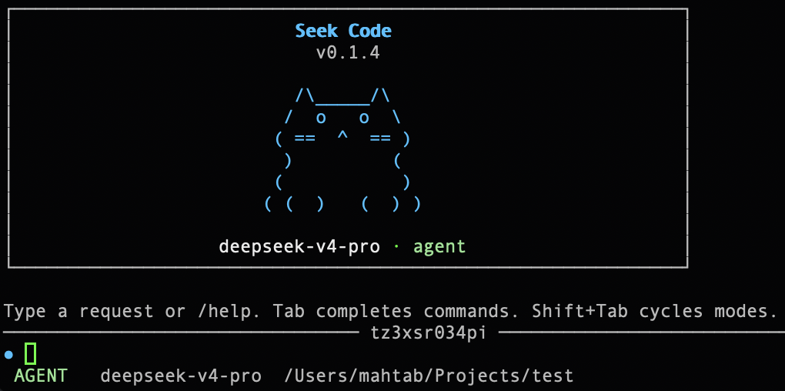

# Seek Code

<p align="center">
  
</p>

<p align="center">
  <strong>面向严肃终端工作流的 DeepSeek-first Code Agent。</strong>
</p>

<p align="center">
  用一个 CLI 完成规划、阅读、修改、执行、验证、回滚和服务化运行。
</p>

<p align="center">
  <a href="./README.md"><strong>English</strong></a>
  &nbsp;·&nbsp;
  <a href="#快速开始">快速开始</a>
  &nbsp;·&nbsp;
  <a href="#功能总览">功能总览</a>
  &nbsp;·&nbsp;
  <a href="#模块地图">模块地图</a>
  &nbsp;·&nbsp;
  <a href="#与其他-code-cli-的对比">对比</a>
</p>

<p align="center">
  
  
  
  
</p>

<p align="center">
  <code>npm install -g seekcode</code>
  &nbsp;&nbsp;
  <code>seek</code>
  &nbsp;&nbsp;
  <code>seek "review this repo"</code>
</p>

---

## 为什么是 Seek Code？

Seek Code 不是“给模型套一个聊天壳”的 CLI，而是一个面向真实工程仓库和长会话终端工作的 Agent Runtime。

它围绕 DeepSeek，尤其是 `deepseek-v4-pro` 做了明确优化，提供的不是单点能力，而是一整套工程工作流：

<table>
  <tr>
    <td><strong>仓库内原生工作</strong></td>
    <td>直接读取文件、修改代码、应用补丁、执行命令、搜索网页、查看 Git 状态，并在终端内完成验证。</td>
  </tr>
  <tr>
    <td><strong>可控的执行方式</strong></td>
    <td>根据需求切换 <code>plan</code>、<code>agent</code>、<code>yolo</code> 三种模式，控制自动化程度和风险边界。</td>
  </tr>
  <tr>
    <td><strong>长流程任务支持</strong></td>
    <td>内置 durable tasks、后台 jobs、artifacts、session 持久化、workspace 回滚快照以及 HTTP/SSE Server。</td>
  </tr>
  <tr>
    <td><strong>可组合的扩展生态</strong></td>
    <td>支持 MCP Server、Skills、Sub-agent、Diagnostics，以及面向 DeepSeek 部署形态的 Provider 映射。</td>
  </tr>
</table>

---

## 快速开始

### 1. 安装

```bash
npm install -g seekcode
```

### 2. 设置 API Key

```bash
export DEEPSEEK_API_KEY="sk-your-api-key"
```

### 3. 启动交互模式

```bash
seek
```

### 4. 或直接执行一次性任务

```bash
seek "summarize this repository"
seek --mode plan "review the current git diff"
seek --model deepseek-v4-pro -r max "design a safe refactor plan"
```

<details>
<summary><strong>建议先试的命令</strong></summary>

<br>

<p>
  <kbd>/help</kbd>
  <kbd>/plan</kbd>
  <kbd>/agent</kbd>
  <kbd>/yolo</kbd>
  <kbd>/model</kbd>
  <kbd>/provider</kbd>
  <kbd>/tokens</kbd>
  <kbd>/cost</kbd>
  <kbd>/tasks</kbd>
  <kbd>/jobs</kbd>
  <kbd>/sessions</kbd>
  <kbd>/restore</kbd>
</p>

</details>

---

## 功能总览

<table>
  <tr>
    <th align="left">能力面</th>
    <th align="left">现在能做什么</th>
  </tr>
  <tr>
    <td><strong>交互式编码</strong></td>
    <td>阅读文件、修改代码、应用 patch、实时展示工具状态，并持续在终端里推进工作。</td>
  </tr>
  <tr>
    <td><strong>执行与验证</strong></td>
    <td>运行 shell 命令、启动后台任务、创建验证 gate，并在代码修改后触发诊断检查。</td>
  </tr>
  <tr>
    <td><strong>规划与任务管理</strong></td>
    <td>使用 checklist、plan、durable tasks 和结构化 runtime events 管理更长链路的工程任务。</td>
  </tr>
  <tr>
    <td><strong>上下文与记忆</strong></td>
    <td>持久化 session、跟踪 token/cost、保存 artifacts、维护 notes，并在需要时恢复工作区快照。</td>
  </tr>
  <tr>
    <td><strong>外部知识与扩展</strong></td>
    <td>搜索和抓取网页、接入 MCP Server，并叠加项目级 Skills。</td>
  </tr>
  <tr>
    <td><strong>部署形态</strong></td>
    <td>既可以作为本地 CLI 使用，也可以作为 HTTP/SSE Agent Server 暴露给上层系统。</td>
  </tr>
</table>

---

## 交互模型

<p align="center">
  
  
  
</p>

<table>
  <tr>
    <th align="left">模式</th>
    <th align="left">行为</th>
    <th align="left">适用场景</th>
  </tr>
  <tr>
    <td><code>plan</code></td>
    <td>只读探索，只运行规划和安全读取类工具。</td>
    <td>仓库熟悉、架构审查、改造前调研、风险分析。</td>
  </tr>
  <tr>
    <td><code>agent</code></td>
    <td>读取类工具自动执行，写入和更高影响操作需要确认。</td>
    <td>真实仓库中的日常开发和结对工作流。</td>
  </tr>
  <tr>
    <td><code>yolo</code></td>
    <td>高信任快速执行，同时保留危险工具保护。</td>
    <td>可信分支、可恢复环境、需要快速推进的任务。</td>
  </tr>
</table>

---

## 模块地图

<table>
  <tr>
    <th align="left">模块</th>
    <th align="left">职责</th>
    <th align="left">包含能力</th>
  </tr>
  <tr>
    <td><strong>Terminal UX</strong></td>
    <td>日常编码时直接面对的交互层。</td>
    <td>TUI、inline/fullscreen 模式、状态栏、实时工具行、选择器、批准弹窗、命令交互。</td>
  </tr>
  <tr>
    <td><strong>Core Agent Runtime</strong></td>
    <td>把自然语言任务转成工具驱动工程动作的核心执行循环。</td>
    <td>thinking/content stream、runtime events、approval、context refresh、prompt pinning、token/cost tracking。</td>
  </tr>
  <tr>
    <td><strong>代码与 Shell 工具</strong></td>
    <td>Agent 在本地工作区里实际调用的工具集。</td>
    <td><code>read</code>、<code>write</code>、<code>edit</code>、<code>apply_patch</code>、<code>search</code>、<code>glob</code>、<code>bash</code>、jobs、verification gates。</td>
  </tr>
  <tr>
    <td><strong>规划与协作</strong></td>
    <td>把复杂工作结构化，而不是让模型随意堆工具调用。</td>
    <td><code>checklist_write</code>、<code>update_plan</code>、persistent notes、durable tasks、sub-agents、parallel reasoning queries。</td>
  </tr>
  <tr>
    <td><strong>质量与恢复</strong></td>
    <td>让改动更可验证，也更容易回退和审计。</td>
    <td>diagnostics、LSP checks、artifacts、rollback snapshots、session restore、task/job visibility。</td>
  </tr>
  <tr>
    <td><strong>可扩展层</strong></td>
    <td>把 Agent 接到外部系统和项目约定上。</td>
    <td>MCP tools、skill discovery/install/trust、provider mapping、本地与 server 双运行形态。</td>
  </tr>
</table>

---

## 为 DeepSeek 而构建

Seek Code 的立场很明确：它把 DeepSeek 当作主要运行时，而不是顺手兼容一下的 OpenAI-compatible 接口。

<table>
  <tr>
    <th align="left">DeepSeek 优势</th>
    <th align="left">在 Seek Code 里的意义</th>
  </tr>
  <tr>
    <td><strong>大上下文</strong></td>
    <td>更适合仓库级理解、长链路规划，以及复杂多轮工程任务中的上下文保持。</td>
  </tr>
  <tr>
    <td><strong>Thinking 可视化</strong></td>
    <td>TUI 可以展示更长的 reasoning turn 和实时工具进度，减少“黑盒等待”的体验。</td>
  </tr>
  <tr>
    <td><strong>Provider 可迁移</strong></td>
    <td>同一个 CLI 可以跑在 DeepSeek、DeepSeek CN、NVIDIA NIM、OpenRouter、Novita、Fireworks 和本地 SGLang 上。</td>
  </tr>
  <tr>
    <td><strong>Pro + Flash 组合</strong></td>
    <td>重任务用 <code>deepseek-v4-pro</code>，轻量并行分析或快速请求可以交给更快的模型。</td>
  </tr>
</table>

---

## 与其他 Code CLI 的对比

这里是定位对比，不是跑分榜。重点是帮助你判断 Seek Code 适合放在哪类工作流里。

<table>
  <tr>
    <th align="left">CLI</th>
    <th align="left">主要偏向</th>
    <th align="left">典型优势</th>
    <th align="left">Seek Code 的差异点</th>
  </tr>
  <tr>
    <td><strong>Seek Code</strong></td>
    <td>DeepSeek-first 工程型 Agent Runtime</td>
    <td>把终端编码、任务运行时、回滚、artifacts、MCP 和 HTTP/SSE 服务组合在一个工作流里。</td>
    <td>更强调 DeepSeek 原生体验、规划优先、运行时可观测性，以及本地长工作流支持。</td>
  </tr>
  <tr>
    <td><strong>Codex CLI</strong></td>
    <td>OpenAI-native 终端编码代理</td>
    <td>与 OpenAI 工具体系和终端代理工作流结合更紧。</td>
    <td>Seek Code 更明确围绕 DeepSeek 部署、模式控制、durable tasks、artifacts 和仓库恢复流来设计。</td>
  </tr>
  <tr>
    <td><strong>Claude Code</strong></td>
    <td>Anthropic-native Code Agent</td>
    <td>强 reasoning 体验、成熟的编码交互和较完整的周边文档生态。</td>
    <td>Seek Code 在 DeepSeek 模型适配、本地 server mode、任务编排和 TypeScript Runtime 可改造性上更激进。</td>
  </tr>
  <tr>
    <td><strong>OpenCode</strong></td>
    <td>开放可定制的 Code Agent 交互层</td>
    <td>开源灵活、社区驱动、便于定制和二次开发。</td>
    <td>Seek Code 更强调 DeepSeek-first 默认配置，以及 rollback、artifacts、diagnostics、MCP lifecycle 这些一体化工程模块。</td>
  </tr>
</table>

<p>
  参考入口：
  <a href="https://help.openai.com/en/articles/11096431-openai-codex-cli-getting-started">Codex CLI</a>、
  <a href="https://docs.anthropic.com/en/docs/claude-code/overview">Claude Code</a>、
  <a href="https://opencode.ai/">OpenCode</a>
</p>

---

## 常见工作流

### 理解一个陌生仓库

```bash
seek --mode plan "survey the repo, identify entrypoints, risks, and likely module boundaries"
```

### 做一个可控改动

```bash
seek --mode agent "fix the failing tests, explain root cause, make the smallest safe patch, and verify it"
```

### 在可信分支里高速推进

```bash
seek --mode yolo "add regression coverage for the config command and run the relevant tests"
```

### 作为本地 Agent Server 运行

```bash
seek serve --port 8080
```

---

## 扩展能力

<table>
  <tr>
    <th align="left">扩展点</th>
    <th align="left">你能得到什么</th>
  </tr>
  <tr>
    <td><strong>MCP</strong></td>
    <td>把外部系统和工具接成 <code>mcp_*</code> 工具，并纳入权限控制和生命周期管理。</td>
  </tr>
  <tr>
    <td><strong>Skills</strong></td>
    <td>通过 <code>SKILL.md</code> 注入项目规范、领域知识和可复用工作流。</td>
  </tr>
  <tr>
    <td><strong>Sub-agents</strong></td>
    <td>为明确边界的子任务生成专用 worker，支持并行调查或并行实现。</td>
  </tr>
  <tr>
    <td><strong>Artifacts</strong></td>
    <td>把大型日志、补丁、诊断结果和证据存到上下文之外，减少主对话污染。</td>
  </tr>
</table>

---

## 命令速览

<details>
<summary><strong>CLI 入口</strong></summary>

<br>

```text
seek [prompt...]
seek update
seek serve
seek config
```

</details>

<details>
<summary><strong>交互命令重点</strong></summary>

<br>

<table>
  <tr>
    <td><code>/plan</code></td>
    <td>切换到只读规划模式</td>
  </tr>
  <tr>
    <td><code>/agent</code></td>
    <td>切换到审批驱动模式</td>
  </tr>
  <tr>
    <td><code>/yolo</code></td>
    <td>切换到高信任快速执行模式</td>
  </tr>
  <tr>
    <td><code>/provider</code> / <code>/model</code></td>
    <td>在会话中切换 provider 或模型</td>
  </tr>
  <tr>
    <td><code>/tokens</code> / <code>/cost</code></td>
    <td>查看 token 使用和成本</td>
  </tr>
  <tr>
    <td><code>/tasks</code> / <code>/jobs</code></td>
    <td>查看 durable tasks 和后台命令</td>
  </tr>
  <tr>
    <td><code>/sessions</code> / <code>/load</code></td>
    <td>保存与恢复会话</td>
  </tr>
  <tr>
    <td><code>/restore</code></td>
    <td>列出并恢复工作区快照</td>
  </tr>
  <tr>
    <td><code>/skills</code> / <code>/skill</code></td>
    <td>使用或管理 Skills</td>
  </tr>
  <tr>
    <td><code>/mcp</code></td>
    <td>管理 MCP Server</td>
  </tr>
</table>

</details>

---

## 配置

Seek Code 当前支持：

<ul>
  <li><strong>Providers：</strong><code>deepseek</code>、<code>deepseek-cn</code>、<code>nvidia-nim</code>、<code>openrouter</code>、<code>novita</code>、<code>fireworks</code>、<code>sglang</code></li>
  <li><strong>Models：</strong>DeepSeek V4 Pro / Flash 及其 Provider 映射名</li>
  <li><strong>UI 模式：</strong>inline scrollback 或 alternate-screen TUI</li>
  <li><strong>安全控制：</strong>approval policy、sandbox 规则、diagnostics severity、status items、rollback enablement</li>
</ul>

<details>
<summary><strong>默认路径与优先级</strong></summary>

<br>

<table>
  <tr>
    <th align="left">项目</th>
    <th align="left">默认路径</th>
    <th align="left">说明</th>
  </tr>
  <tr>
    <td><strong>用户配置</strong></td>
    <td><code>~/.seekcode/config.toml</code></td>
    <td>首次使用时会自动创建。</td>
  </tr>
  <tr>
    <td><strong>项目配置</strong></td>
    <td><code>./.seekcode/config.toml</code></td>
    <td>在当前仓库内覆盖用户级配置。</td>
  </tr>
  <tr>
    <td><strong>Sessions</strong></td>
    <td><code>${XDG_DATA_HOME:-~/.local/share}/seekcode/sessions</code></td>
    <td>可用 <code>SEEKCODE_SESSIONS_DIR</code> 覆盖。</td>
  </tr>
  <tr>
    <td><strong>Artifacts</strong></td>
    <td><code>${XDG_DATA_HOME:-~/.local/share}/seekcode/artifacts</code></td>
    <td>可用 <code>SEEKCODE_ARTIFACTS_DIR</code> 覆盖。</td>
  </tr>
  <tr>
    <td><strong>Tasks</strong></td>
    <td><code>${XDG_DATA_HOME:-~/.local/share}/seekcode/tasks/tasks.json</code></td>
    <td>可用 <code>SEEKCODE_TASKS_DIR</code> 覆盖。</td>
  </tr>
  <tr>
    <td><strong>全局 Skills</strong></td>
    <td><code>~/.seekcode/skills</code></td>
    <td>也是 <code>skills_dir</code> 的默认值。</td>
  </tr>
  <tr>
    <td><strong>项目 Skills</strong></td>
    <td><code>./.seekcode/skills</code></td>
    <td>同时也会扫描 <code>./skills</code> 和 <code>./.agents/skills</code>。</td>
  </tr>
  <tr>
    <td><strong>回滚快照</strong></td>
    <td><code>./.seekcode/side-git</code></td>
    <td><code>/restore</code> 使用的工作区本地快照存储。</td>
  </tr>
</table>

<p>
  <strong>优先级：</strong>
  默认值
  <code>&lt;</code>
  用户配置
  <code>&lt;</code>
  项目配置
  <code>&lt;</code>
  环境变量
  <code>&lt;</code>
  CLI 参数
</p>

<p>
  <strong>旧配置迁移：</strong>
  <code>seek config migrate --target user|project</code> 可以从
  <code>~/.config/deepseek/config.toml</code> 或 <code>./.deepseek/config.toml</code>
  导入。旧路径用于迁移，不会在正常启动时自动加载。
</p>

</details>

<details>
<summary><strong>配置示例</strong></summary>

<br>

```toml
provider = "deepseek"
model = "deepseek-v4-pro"
flash_model = "deepseek-v4-flash"
mode = "agent"
reasoning_effort = "high"
context_limit = 1000000
approval_policy = "on-request"
sandbox_mode = "workspace-write"
lsp_auto_diagnostics = true
rollback_enabled = true
status_items = ["mode", "model", "workspace", "cache", "tools", "cost", "hints"]
```

</details>

---

## 开发

```bash
npm install
npm run build
npm test
```

需要 Node.js `>=22`。

---

## License

MIT
